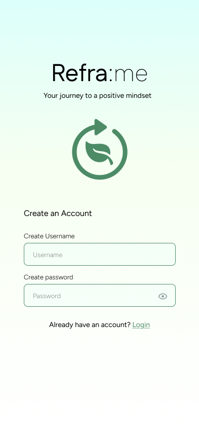
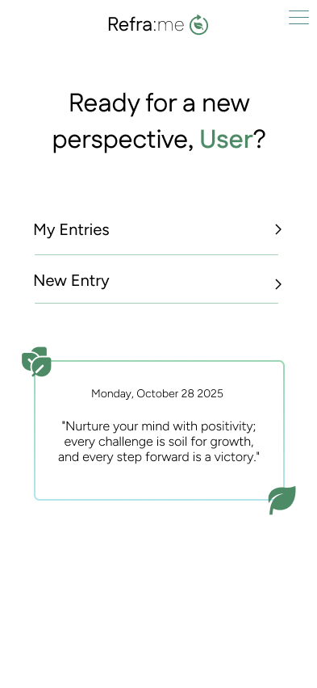
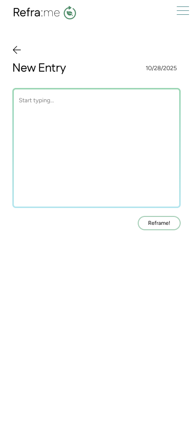
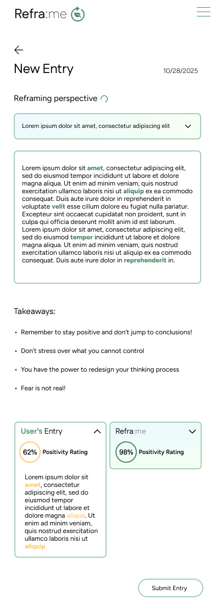
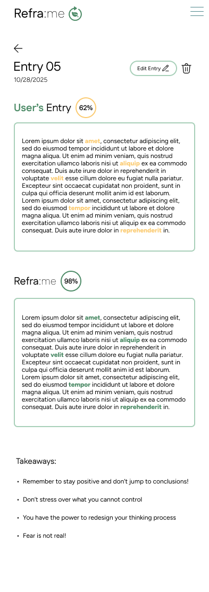
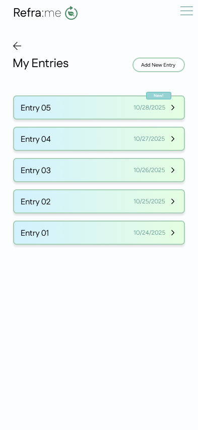
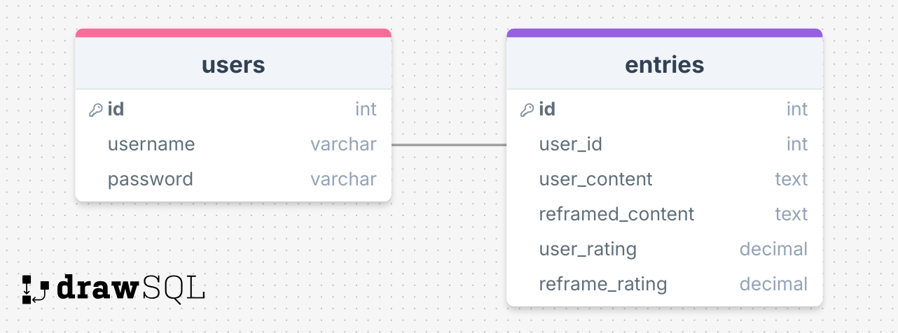

Refra:me

## Overview

Refra:me is a thought reframing app designed to cultivate a positive mindset through the form of AI assisted journal entries.

### Problem Space

It’s easy to default to a pessimistic mindset when faced with life’s challenges. Reframing your perspective can be difficult, especially if you’re accustomed to thinking negatively. Refra:me keeps this in mind. Those who struggle to find peace or see alternative perspectives may feel isolated in their thoughts, wishing someone could simply show them how to think in a way that leads to positivity. With Refra:me, your journey to a positive mindset is just a touch a way.

### User Profile

- Growth-oriented individuals:
  - who are working on cultivating a positive mindset
  - who are looking for a clear sense of direction
  - who are willing to change their perspective on life

### Features

- As a user, I want to be able to process my thoughts using journal entries
- As a user, I want my thoughts to be reframed with the help of AI, so I can gain a new perspective
- As a user, I want to be able to compare my original entries with the optimized versions done by Refra:me
- As a user, I want to have access to all my entries in one place
- As a user, I want to be able to create an account to be sure my thoughts are secure and accessible to only me
- As a user, I want to be able to login to access all the above features on my account

## Implementation

### Tech Stack

- React
- Tailwind CSS
- HeroUI/MaterialUI Components
- Client libraries:
  - react
  - react-router
  - axios
  - @supabase/supabase-js
- Backend-as-a-Service:
  - Supabase Auth
  - PostgreSQL Database
- Deployment:
  - Netlify

### APIs

- Google Gemini API

### Sitemap

Login/Signup Page
Home Page
New Entry Page
Reframing/Entry Submission Page
Submitted Entry Page
All Entries Page

### Mockups

#### Login/Signup Page



#### Home Page



#### New Entry Page



#### Reframing/Entry Submission Page



#### Submitted Entry Page



#### All Entries Page



### Data



### Endpoints

**POST /users/register**

- Register a new user account

Parameters:

- username: User's username
- password: User's password

Response:

```
{
    "token": "eyJhbGciOiJIUzI1NiIsInR5cCI6IkpXVCJ9...",
    "user": {
        "id": 1,
        "username": "reframeuser"
    }
}

```

**POST /users/login**

- Login a user

Parameters:

- username: User's username
- password: User's password

Response:

```
{
    "token": "eyJhbGciOiJIUzI1NiIsInR5cCI6IkpXVCJ9...",
    "user": {
        "id": 1,
        "username": "reframeuser"
    }
}

```

**GET /entries**

- Get all entries for the logged-in user

Parameters:

- token: JWT of the logged in user

Response:

```
[
    {
        "id": 1,
        "user_id": 1,
        "user_content": "I had a stressful day at work today...",
        "reframed_content": "Today presented challenges that helped me grow professionally...",
        "user_rating": 0.10,
        "reframe_rating": 0.70,
    },
    {
        "id": 2,
        "user_id": 1,
        "user_content": "My presentation didn't go well...",
        "reframed_content": "My presentation gave me valuable feedback for improvement...",
        "user_rating": 0.80,
        "reframe_rating": 0.90,
    },
]

```

**GET /entries/:id**

- Get a specific entry by id

Parameters:

- id: Entry id as number
- token: JWT of the logged in user

Response:

```
{
    "id": 1,
    "user_id": 1,
    "user_content": "I had a stressful day at work today...",
    "reframed_content": "Today presented challenges that helped me grow professionally...",
    "user_rating": 0.35,
    "reframe_rating": 0.85,
}

```

**POST /entries**

- Create a new journal entry (will automatically generate reframed content and ratings to include in full entry)

Parameters:

- token: JWT of the logged in user
- user_content: The journal entry text written by the user

Response:

```
{
    "id": 3,
    "user_id": 1,
    "user_content": "I failed my exam and feel terrible...",
    "reframed_content": "While the exam didn't go as planned, it's an opportunity to identify areas for improvement...",
    "user_rating": 0.15,
    "reframe_rating": 0.65,
}

```

**PUT /entries/:id**

- Update an existing journal entry (will regenerate reframed content and ratings)

Parameters:

- id: Entry id
- token: JWT of the logged in user
- user_content: The updated journal entry text

Response:

```
{
    "id": 1,
    "user_id": 1,
    "user_content": "I had a stressful day at work today, but managed to complete my tasks...",
    "reframed_content": "Despite the stress, I demonstrated resilience by completing all my tasks today...",
    "user_rating": 0.45,
    "reframe_rating": 0.90,
}

```

**DELETE /entries/:id**

- Delete a journal entry

Parameters:

- id: Entry id
- token: JWT of the logged in user

Response:

```
{
    "message": "Entry successfully deleted",
    "id": 1
}

```

### Auth

- Supabase JWT Authentication
  - Before implementing auth, all API requests will use a test user with id 1 for development
  - Authentication will be added after core journal entry features are working
  - Supabase handles JWT creation and validation automatically when users register/login
  - JWTs will be stored in localStorage and cleared when users log out
  - Row-level security in PostgreSQL will restrict users to only see their own entries

## Roadmap

- Create client

  - Set up Vite project with React
  - Install dependencies (react-router, axios, Supabase client, Tailwind CSS)
  - Configure UI component library (HeroUI/MaterialUI)
  - Create boilerplate pages and routes

- Configure Supabase backend

  - Create Supabase project
  - Set up database tables (users and entries)
  - Configure authentication settings
  - Implement row-level security policies

- Connect frontend to backend

  - Create Supabase client in React app
  - Set up authentication context
  - Create protected routes
  - Test connection with basic queries

- Deploy base application

  - Set up Netlify deployment
  - Configure environment variables
  - Enable continuous and automatic deployment from repository

- Feature: Journal entry creation

  - Build journal entry input form
  - Connect form to Supabase database

- Feature: AI content reframing

  - Set up Google Gemini API integration
  - Create sentiment analysis service
  - Implement thought reframing functionality
  - Store reframed content and ratings

- Feature: Journal entries list

  - Create entries listing page
  - Fetch entries from Supabase
  - Display entries with creation dates

- Feature: Entry submission view

  - Create detailed entry page
  - Display original and reframed content
  - Show positivity ratings comparison
  - Add edit and delete functionality

- Feature: User authentication

  - Implement register page + form
  - Implement login page + form
  - Set up login/logout functionality
  - Store JWT in localStorage
  - Add authentication state to UI components

UI refinement

Add loading states and transitions

Improve error handling

Bug fixes and optimization

DEMO DAY

## Future Implementations

- Add filtering and sorting options
- Add more data visualization for each entry such as graphs, images, etc
- Add a lock entry option
- Add a favorite entry option
- Add theme change
- Convert application into mobile application for iOS and Android using React Native
- Create user profile page
  - Implement settings options
  - Add account management features
